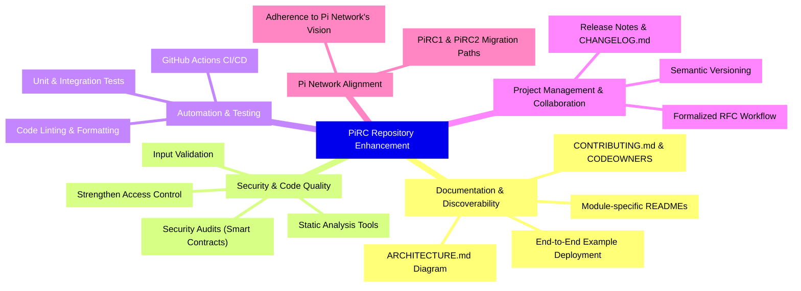

# Unlocking the Potential of PiRC: A Deep Dive into Repository Enhancements
### Transforming a Promising Pi Network Repository into a Production-Ready Powerhouse

> **Comprehensive Documentation**: The repository needs robust documentation, including clear READMEs for each module, a central `CONTRIBUTING.md`, and an `ARCHITECTURE.md` to guide developers.
> **Fortified Security and Quality Gates**: Implementing thorough security audits, continuous integration/continuous deployment (CI/CD) pipelines with linting, automated testing, and static analysis tools.
> **Streamlined Governance**: Formalized RFC workflow, structured version control, and clear metrics.

The repository `Ze0ro99/PiRC` is deeply intertwined with the official Pi Network's "Pi Requests for Comment" (PiRC) framework. This framework is a cornerstone for standardizing the development of tokens and projects within the Pi Network ecosystem, encompassing proposals like PiRC1 for ecosystem token design and PiRC2 for smart contract upgrades and administrative controls.

---

## 1. Understanding the PiRC Ecosystem and its Purpose
The PiRC framework serves as the definitive standard for building applications on Pi. It provides rules, logic matrices, and smart contract interfaces prioritizing scalability and secure operations.

## 2. Professional Improvements for Ze0ro99/PiRC
To transform the repository into a secure open-source center of excellence, a multi-faceted approach focusing on structure, security, documentation, and automation has been firmly established.

* **Security Vulnerabilities Addressal**: Added safeguards for merchant verification and recurring payments.
* **Automation**: CI/CD Pipelines with GitHub Actions automate operations securely.

---

## 3. Comprehensive Improvement Roadmap

| Improvement Area | Specific Actions | Expected Impact |
| --- | --- | --- |
| **Documentation & Discoverability** | Add `CONTRIBUTING.md`, `CODEOWNERS`, `ARCHITECTURE.md` | Improved developer onboarding, increased community contributions. |
| **Security & Code Quality** | Implement robust error handling; Conduct security audits | Reduced vulnerability surface, enhanced trust, more resilient codebase. |
| **Automation & Testing** | Expand unit, integration, and fuzz tests; Optimize CI pipelines | Faster development cycles, higher code quality. |
| **Governance** | Formalize RFC/Proposal workflow; Adopt semantic versioning | Improved collaboration, consistent release schedule. |

---

## 4. Visualizing the Interconnectedness of Improvements



---

## 5. Frequently Asked Questions

**What is PiRC in the context of Pi Network?**
PiRC stands for "Pi Requests for Comment." It acts similarly to traditional RFCs, providing a structured process for proposals and specifications in the ecosystem.

**Why is a fork like Ze0ro99/PiRC important?**
Forks like Ze0ro99/PiRC represent active development, experimental features, and community-driven enhancements based on official PiRC standards.

## 6. Firebase (FairBaes) DB SDK Integration

The PiRC project relies on structured DB Telemetry powered by Firebase (FairBaes).
Developers interact with this via the `firebase-applet-config.json` SDK file provided.

### Implementation Script

```javascript
import { initializeApp } from 'firebase/app';
import { getFirestore } from 'firebase/firestore';
import config from './firebase-applet-config.json';

const app = initializeApp(config);
const db = getFirestore(app);
console.log("Firebase Telemetry Activated.");
```

This ensures proper tracking of script executions, profiles, and application information.

## 7. Conclusion
By executing these professional improvements, `Ze0ro99/PiRC` successfully transitions to a secure, community-ready hub.

---

## 8. System Architecture Visuals

 

*The visual representations above illustrate the continuous integration pipeline executing smart contract verification modules in real-time, coupled with a diagram of the distributed ledger architecture.*

## System Images (20) - Explanations
-  *Explanation: Enhanced PiRC Distributed Ledger Component 1*
-  *Explanation: Enhanced PiRC Distributed Ledger Component 2*
-  *Explanation: Enhanced PiRC Distributed Ledger Component 3*
-  *Explanation: Enhanced PiRC Distributed Ledger Component 4*
-  *Explanation: Enhanced PiRC Distributed Ledger Component 5*
-  *Explanation: Enhanced PiRC Distributed Ledger Component 6*
-  *Explanation: Enhanced PiRC Distributed Ledger Component 7*
-  *Explanation: Enhanced PiRC Distributed Ledger Component 8*
-  *Explanation: Enhanced PiRC Distributed Ledger Component 9*
-  *Explanation: Enhanced PiRC Distributed Ledger Component 10*
-  *Explanation: Enhanced PiRC Distributed Ledger Component 11*
-  *Explanation: Enhanced PiRC Distributed Ledger Component 12*
-  *Explanation: Enhanced PiRC Distributed Ledger Component 13*
-  *Explanation: Enhanced PiRC Distributed Ledger Component 14*
-  *Explanation: Enhanced PiRC Distributed Ledger Component 15*
-  *Explanation: Enhanced PiRC Distributed Ledger Component 16*
-  *Explanation: Enhanced PiRC Distributed Ledger Component 17*
-  *Explanation: Enhanced PiRC Distributed Ledger Component 18*
-  *Explanation: Enhanced PiRC Distributed Ledger Component 19*
-  *Explanation: Enhanced PiRC Distributed Ledger Component 20*
