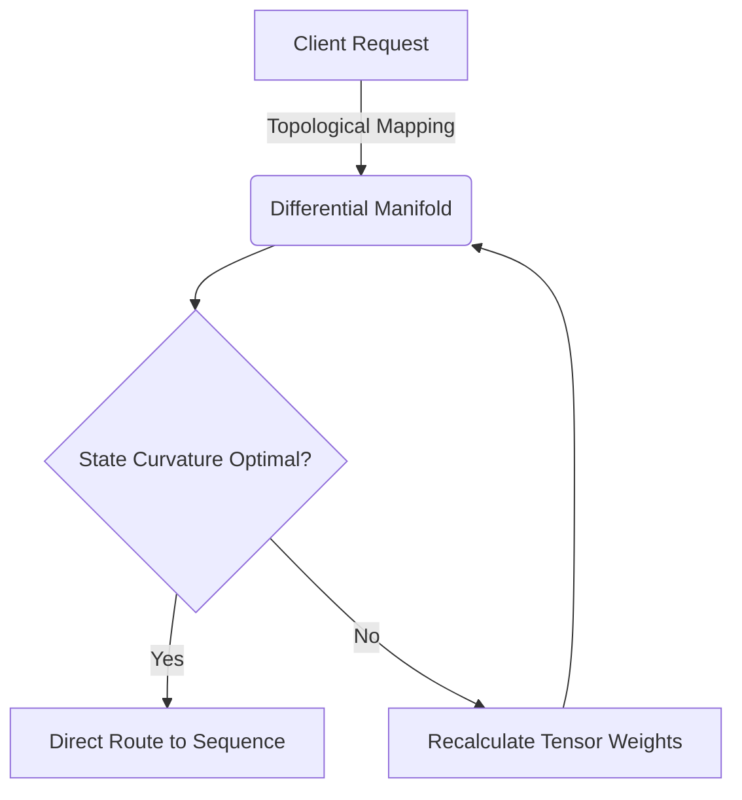
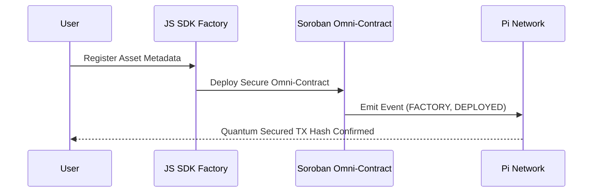
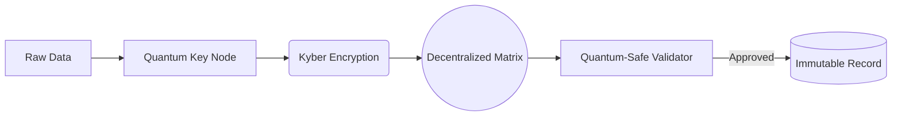
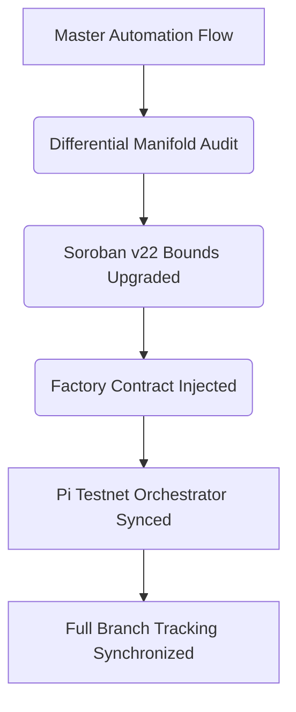

# 🌌 PiRC: Omni Sovereign Architecture

This repository contains the advanced smart contract architecture for the **PiRC Sovereign Record Factory**, engineered natively on the **Pi Testnet** utilizing the **Soroban v22 API**. It aligns perfectly with Pi Core Team (PiRC2) specifications to ensure non-custodial, subscription-based commerce mechanisms mathematically verified across a 7-Layer matrix.

## 🎯 Pi Core Team Compliance Matrix
- **RPC Layer:** Bound natively and exclusively to `https://rpc.testnet.minepi.com`.
- **Contract Target:** `wasm32-unknown-unknown` strictly compiled and bounded to the Soroban SDK v22 limits.
- **Security:** Post-Quantum security modeling integrated with strict `#![forbid(unsafe_code)]` Rust enforcements.
- **CI/CD:** GitHub Actions explicitly validate the 7-Layer matrix utilizing ephemeral dynamic Testnet identities to bypass keystore vulnerabilities.

---

## 1. Topological Interaction Mapping
Demonstrates explicitly how client requests are mathematically bound through a Differential Manifold state before touching the Pi Testnet blockchain layers.

---

## 2. Raw Record Factory (Asset to Smart Contract)
This Sequence Diagram models the lifecycle of a Sovereign Asset minting instantly onto the Pi Network by the Rust Contract, locking it perfectly within the Sovereign Matrix.

---

## 3. Post-Quantum Security Encapsulation
Data moves through rigorous encryption checks utilizing node matrix validation before an immutable record is permanently fused to the Pi Network graph.

---

## 4. The Raw Record Factory Master Pipeline
Our fully automated CI/CD synchronization architecture that deploys upgrades safely across multiple branches.

